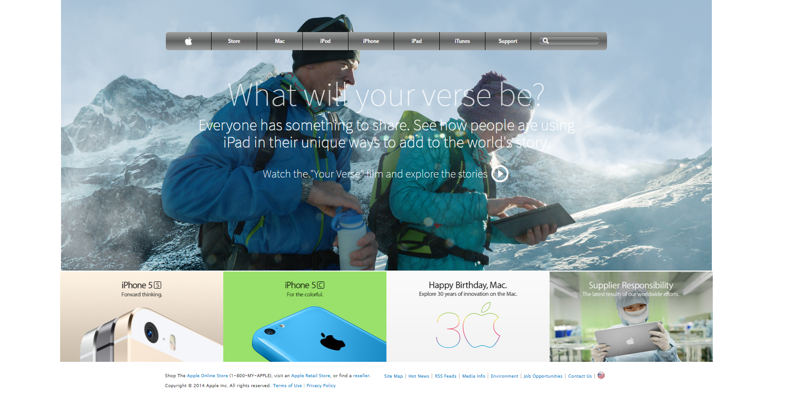

# Building-with-Backgrounds-and-Gradients

> Building a webpage using images as a background and adding gradients to elements.

The goal is to make a clone of old an old version of the Apple website webpage..

## Built With

- HTML,
- CSS.

## Live Demo

[Live Demo Link](https://raw.githack.com/Bismarck-GM/Building-with-Backgrounds-and-Gradients/homepage/index.html)

## Author

👤 **Gerónimo Morisot**

- Github: [@Bismarck-GM](https://github.com/Bismarck-GM)
- Twitter: [@Rewritablee](https://twitter.com/Rewritablee)
- Linkedin: [Gerónimo Morisot](https://linkedin.com/in/geronimomorisot)

## 🤝 Contributing

Contributions, issues and feature requests are welcome!

Feel free to check the [issues page](issues/).

## Show your support

Give a ⭐️ if you like this project!

## 📝 License

This project is [MIT](lic.url) licensed.
